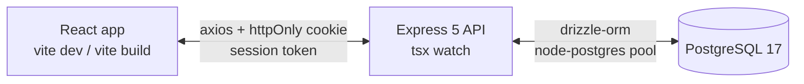

# Activity Tracker

> **A learning project, not a production application.**
>
> The point of this repo is to wire up a small full-stack app **from primitives** so the moving parts stay visible. Where a real product would reach for a library, this project intentionally writes the thing by hand to learn how it works.

## How this codebase was built

The **foundation was designed and written by hand** — the schema, the auth model, the request lifecycle, the React folder convention, the styling primitives, the data-fetching pattern. Those are the parts the project exists to learn, so they're the parts that got the manual treatment.

After the foundation was in place, **AI assistance was used to speed up three things**:

- **UI features** built on top of the existing patterns (additional pages, components, modals).
- **Mass code organization** to apply the structural conventions consistently across the codebase (the PascalCase feature folders, the dedupe of inline Tailwind strings into `styles/classNames.ts`, the splitting of oversized files into per-feature modules, the threading of `AbortSignal` through every read service, etc.).
- **Documentation** — the `docs/` folders in both tiers, the per-tier READMEs, and this root README itself were drafted with AI assistance and then edited.

Treat that disclosure the same way you'd treat a "scaffolded by Vite" or "generated by Drizzle Kit" note — useful context for anyone reading the code who wants to know what came from a deliberate design choice vs an automated pass.

## What this project is for

Specifically, the goals are to get hands-on practice with:

- **PostgreSQL** as the system of record (Drizzle ORM as a thin typed wrapper, not a query abstraction).
- **Express** as a vanilla HTTP layer, with hand-rolled middleware, validation, and route guards.
- **React + TypeScript + Vite** on the frontend, with proper code-splitting, lazy routes, and React 19 features.
- **Efficient data fetching without React Query, SWR, or tRPC.** Every fetch goes through a tiny custom hook layer (`useTasks`, `useTeam`, `useDebouncedSearch`, etc.) that handles cancellation, stale-response guarding, and request deduplication explicitly. The trade-off is no auto-cache / refetch-on-focus / retry-with-backoff out of the box — you can see exactly what each component asks for.
- **In-house session management instead of `Auth.js` / `next-auth`.** Auth uses an `httpOnly` cookie carrying an opaque random token; the database stores only its SHA-256 hash plus revocation metadata. No JWTs. No third-party identity provider. The full lifecycle (issue → validate → revoke → expire) lives in this codebase.

## What this project is not for

- It is **not hardened for production**. CORS / rate limits / TLS / cookie flags are sensible-default-ish, but there's no audit log, no CSRF token, no email verification, no password reset flow, no observability stack, no health check beyond `select 1`, no horizontal scaling story.
- It is **not a template you should fork verbatim** to ship a real product. Use it to read the code and then pick the right battle-tested library when you need one for real.
- It is **not a reference for "best practices."** It's a reference for *understanding* the practices a library would otherwise hide from you.

## Architecture at a glance



| Tier | Stack | Lives in |
|------|-------|----------|
| Database | PostgreSQL 17 (any reachable instance — local Postgres in dev, a managed provider that doesn't force VPC setup for shared use), Drizzle ORM, `drizzle-kit` migrations | [`backend/config/`](backend/config/) |
| API | Node 20+ ESM, Express 5, `cookie-parser`, `helmet`, `morgan`, `express-rate-limit`, `bcrypt` | [`backend/`](backend/) |
| Auth | DB-backed cookie sessions (32-byte random token, SHA-256 hash in DB) | [`backend/controllers/auth.ts`](backend/controllers/auth.ts), [`backend/middleware/index.ts`](backend/middleware/index.ts), [`backend/utils.ts`](backend/utils.ts) |
| Web | React 19 + TypeScript 6, Vite 8, Tailwind 4, React Router 7, `axios`, `react-hot-toast` | [`frontend/`](frontend/) |
| Data fetching | Hand-rolled hooks + `AbortController` cancellation + axios response interceptor | [`frontend/src/hooks/`](frontend/src/hooks/), [`frontend/src/services/`](frontend/src/services/) |

Each tier has its own README + docs folder:

- [`backend/README.md`](backend/README.md) → high-level overview
- [`backend/docs/`](backend/docs/) → architecture, auth + sessions, database, API reference, middleware, development workflow
- [`frontend/README.md`](frontend/README.md) → high-level overview
- [`frontend/docs/`](frontend/docs/) → architecture, routing, auth + session, data fetching, components + styling, hooks, forms + validation, errors + feedback, development workflow

## Repository layout

```text
activity-tracker/
├── README.md                 you are here
├── vercel.json               static-only frontend deploy config
├── backend/                  Express API + Drizzle schema
│   ├── README.md
│   ├── docs/                 deep-dive docs (one topic per file)
│   ├── server.ts
│   ├── config/               db client + Drizzle schema
│   ├── controllers/          one file per resource
│   ├── routes/               thin route -> controller wiring
│   ├── middleware/           isSignedIn / isAdmin
│   ├── scripts/seed.ts       idempotent dev seeder
│   └── ...
└── frontend/                 React + Vite app
    ├── README.md
    ├── docs/                 deep-dive docs (one topic per file)
    ├── src/
    │   ├── pages/            thin orchestrators (lazy-loaded)
    │   ├── components/       PascalCase feature folders
    │   ├── hooks/            data-fetching + UI primitives
    │   ├── services/         axios wrappers per resource
    │   ├── context/          AuthContext, AppContext
    │   ├── styles/           canonical Tailwind class strings
    │   ├── constants/, types/, utils/
    │   └── ...
    └── ...
```

## Quick start

```bash
# 1. Backend
cd backend
cp .env.example .env          # if present; otherwise create .env (see backend/docs/development.md)
npm install
npm run dev                   # tsx watch — http://localhost:3000

# 2. Frontend (in a separate terminal)
cd frontend
echo 'VITE_BACKEND_URL=http://localhost:3000/api' > .env   # match your backend port
npm install
npm run dev                   # Vite dev server — http://localhost:5173
```

Optional: seed the database with fake users + tasks:

```bash
cd backend
npm run seed
```

See the per-tier docs for environment variables, scripts, and deeper walkthroughs.

## Design choices worth knowing

These are the bits where this project deliberately picks the "do it by hand" path — they're each documented in detail under the per-tier `docs/` folders.

| Choice | Library it intentionally avoids | Why | Reference |
|--------|--------------------------------|-----|-----------|
| Custom hooks (`useTasks`, `useTeam`, `useUser`, `useDebouncedSearch`) | React Query, SWR, tRPC | See the full request lifecycle (loading → cancellation → stale-guard → result) without an opaque cache | [`frontend/docs/data-fetching.md`](frontend/docs/data-fetching.md) |
| `AbortController` threaded into every read service + `axios.isCancel` swallowed by the interceptor | None | Real HTTP cancellation on the wire, not just stale-state ignore | [`frontend/docs/data-fetching.md`](frontend/docs/data-fetching.md) |
| DB-backed cookie sessions with SHA-256 hashed tokens | `Auth.js`, `next-auth`, `passport`, JWTs | Per-session revocation, instant logout, no token-leak window | [`backend/docs/auth-and-sessions.md`](backend/docs/auth-and-sessions.md) |
| Hand-rolled `RequireAuth` / `RequireAdmin` route guards + `isAuthLoading` flag | Router-bundled auth wrappers | Avoid flicker without external state libraries | [`frontend/docs/routing.md`](frontend/docs/routing.md), [`frontend/docs/auth-and-session.md`](frontend/docs/auth-and-session.md) |
| Single axios response interceptor for logging + 401 dispatch + cancellation swallow | API-client SDK or middleware framework | One choke point for cross-cutting HTTP concerns | [`frontend/docs/data-fetching.md`](frontend/docs/data-fetching.md) |
| Drizzle ORM as a thin typed wrapper, no repository / DAO pattern | Heavyweight ORMs (Prisma, TypeORM) | Keep SQL queries readable in the controllers | [`backend/docs/database.md`](backend/docs/database.md) |

## License

No license file — treat this as personal learning code. Don't ship it; read it.
