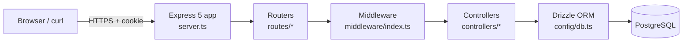
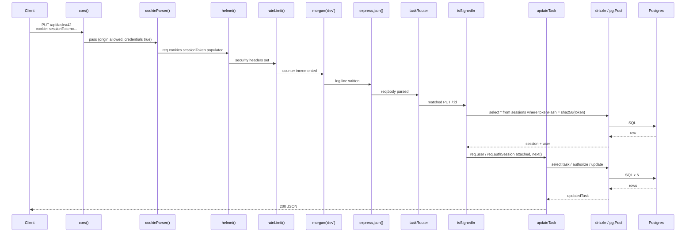
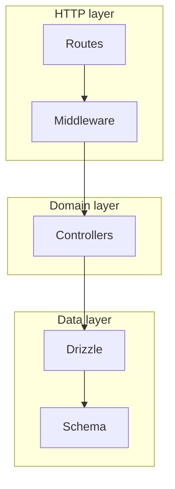

# Backend architecture

A guided tour of how a request travels through the API and why each layer exists.

## High-level shape



There is **no service layer / no repository pattern**. Controllers talk directly to Drizzle. The trade-off is that controllers know about table names; the upside is that the SQL is right there when you read the handler.

## File-by-file responsibility

| Path | Responsibility | Notes |
|------|----------------|-------|
| [`server.ts`](../server.ts) | Wire the Express app: register global middleware in order, mount routers, log DB connectivity, listen on `PORT` | Everything that runs once at boot lives here |
| [`config/db.ts`](../config/db.ts) | Construct the `pg.Pool` and the Drizzle client | Singleton — imported everywhere else |
| [`config/schema.ts`](../config/schema.ts) | Drizzle table definitions + Postgres enums + indexes | This file *is* the migration source — `drizzle-kit` reads it |
| [`middleware/index.ts`](../middleware/index.ts) | `isSignedIn`, `isAdmin` — cookie -> session row -> user lookup | Attaches `req.user` and `req.authSession`. See [`middleware.md`](middleware.md) |
| [`routes/*.ts`](../routes/) | One file per resource. Maps HTTP verbs + paths to controllers and inserts auth middleware | Routers are intentionally dumb |
| [`controllers/*.ts`](../controllers/) | Business logic + Drizzle queries + response shaping | One file per resource. Pure functions of `(req, res)` |
| [`utils.ts`](../utils.ts) | `hashToken`, `generateSessionToken`, `createSession`, `setSessionCookie`, `parseId` | Cross-cutting helpers that don't fit elsewhere |
| [`consts.ts`](../consts.ts) | `BCRYPT_SALT_ROUNDS = 10`, `SESSION_COOKIE_MAX_AGE_MS = 7d` | Single source of truth for tunables |
| [`types.ts`](../types.ts) | Drizzle-inferred app types: `User`, `NewUser`, `Task`, `DbSession`, etc. | `InferSelectModel` / `InferInsertModel` — shape stays in sync with schema automatically |
| [`types/express.d.ts`](../types/express.d.ts) | Augments `Express.Request` with `req.user` and `req.authSession` | Why TypeScript knows about the fields the middleware attaches |
| [`scripts/seed.ts`](../scripts/seed.ts) | Idempotent fake-data seeder | `npm run seed` |

## Request lifecycle

Concrete walkthrough using `PUT /api/tasks/42` as the example.



The interesting parts:

- The cookie is parsed **before** any handler that wants to look it up.
- `helmet` runs **before** the route handlers but **after** `cors` (CORS preflight responses don't get the security headers, which is fine).
- `morgan` runs **before** `express.json` so even rate-limited requests show up in the log.
- `isSignedIn` does **two** queries (sessions + users). Acceptable for this learning project — a real app would join or cache.

## Global middleware order ([`server.ts`](../server.ts))

```text
1. cors({ origin: FRONTEND_ORIGIN, credentials: true })
2. cookieParser()
3. helmet()
4. morgan('dev')
5. rateLimit({ windowMs: 5 * 60 * 1000, max: 300 })
6. express.json()
7. routers: /api/tasks, /api/auth, /api/teams, /api/users, /api/join-requests
```

Why this order:

- `cors` first so preflights short-circuit before the rate-limit counter ticks.
- `cookieParser` before any auth-touching middleware (controllers can also read `req.cookies` directly — see `logout`).
- `helmet` early so security headers land on every response, including the rate-limit `429` body.
- `morgan` before `express.json` so payload-parsing failures still log a line.
- Rate limit is **300 req / 5 min / IP** — generous because dev includes live-typed search.

## Layered design



- **HTTP layer** decides *who* can reach a controller (auth, admin, rate limit) and *what shape* the request must take to be parsable. It does **not** know about table columns.
- **Domain layer** (controllers) decides *what to do* with a parsed, authenticated request. It owns input validation specific to the resource (e.g. "title is required") and permission checks specific to the resource (e.g. "owner or teammate or admin can update").
- **Data layer** is just Drizzle on top of `pg`. There's no abstraction over Drizzle.

## Error handling

There is intentionally no central error-handling middleware in this project. Controllers each `try/catch` and return `500 { message: "Internal server error" }` for unexpected failures. This makes the catch sites visible (you can see exactly what gets coerced into a 500 instead of a 4xx).

If you wanted one, you'd add `app.use((err, req, res, next) => { ... })` after the routers in `server.ts` and convert controllers to `next(err)` instead of try/catch. That's a deliberate non-goal for this learning project.

## What this architecture is good for

- Reading top-to-bottom and understanding every step.
- Adding a new resource (copy a routes file, copy a controllers file, add a table to `schema.ts`, register the router in `server.ts`).
- Trying out auth/authorization patterns without an opinion-laden framework getting in the way.

## What it would need for production

- A real error-handling middleware + structured logging (winston, pino).
- Schema validation at the HTTP boundary (zod or similar) instead of `as { x: string }` casts.
- Per-route input rate limits (auth endpoints especially).
- CSRF tokens (sameSite: lax helps but isn't sufficient for state-changing GETs).
- A dedicated read-replica connection or a query cache for hot paths.
- A health endpoint surfaced for the load balancer.
- Telemetry (OpenTelemetry, request IDs propagated through logs).

These are deliberately out of scope.
