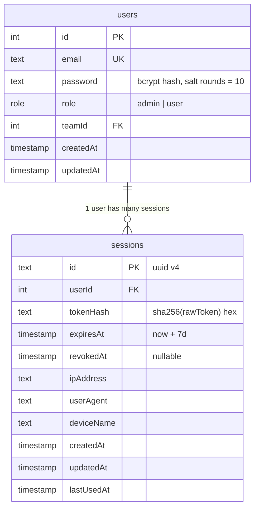

# Auth & sessions

This is the deepest "do it by hand instead of a library" choice in the project. Read [`../README.md`](../README.md) and [`architecture.md`](architecture.md) first if you haven't.

## The model in one paragraph

When a user logs in, the server generates a **32-byte cryptographically random token**, stores its **SHA-256 hash** plus metadata in the `sessions` table, and sends the **raw token** back to the browser in an `httpOnly`, `sameSite: lax` cookie named `sessionToken`. On every subsequent request the cookie is hashed again and looked up against the table; if the row is missing, expired, or revoked, the request is treated as anonymous. Logging out deletes the row and clears the cookie.

No JWT. No `express-session`. No `Auth.js`. The full lifecycle lives in three files: [`controllers/auth.ts`](../controllers/auth.ts), [`utils.ts`](../utils.ts), and [`middleware/index.ts`](../middleware/index.ts).

## Why not JWT?

JWTs are stateless tokens. That's their pitch, and it's also their problem in a small CRUD app:

- **Revocation needs state anyway.** As soon as you want "log out everywhere" or "expire this session because the password changed," you need a server-side allow- or deny-list — at which point you've reinvented sessions with extra steps.
- **Token leak = full account takeover until expiry.** With DB sessions you can `delete from sessions where userId = ?` and the next request is anonymous. With JWTs you'd need a deny-list with the JWT's `jti` and an expiry-aware purge job.
- **Payload bloat in every request.** A JWT carries claims; a session token is 64 hex characters.

## Why not `Auth.js` (`next-auth`)?

`Auth.js` is excellent — it's just the wrong fit for *learning what an auth system actually does*. It hides the cookie, the session table, the CSRF token, the refresh logic, and the OAuth dance behind a single `auth()` call. This project deliberately walks through each of those primitives so you've seen them at least once.

## Tables



Indexes on `sessions`: `userId`, `tokenHash`, `createdAt`, `updatedAt`, `ipAddress`, `revokedAt`.

The `tokenHash` index is what makes the per-request lookup fast (single index read). The `userId` index is what makes "revoke all sessions for user X" cheap.

See [`config/schema.ts`](../config/schema.ts) for the canonical definitions.

## Lifecycle

```mermaid
sequenceDiagram
  participant Browser
  participant Auth as POST /api/auth/login
  participant Util as utils.createSession
  participant Sessions as sessions table
  participant Mw as isSignedIn (next request)

  Browser->>Auth: { email, password }
  Auth->>Auth: bcrypt.compare(password, user.password)
  Auth->>Util: createSession({ user, req })
  Util->>Util: token = crypto.randomBytes(32).hex<br/>hash = sha256(token)
  Util->>Sessions: insert (userId, tokenHash, expiresAt, ip, ua, deviceName)
  Util-->>Auth: { sessionToken, sessionId, user }
  Auth->>Browser: Set-Cookie sessionToken=<raw><br/>HttpOnly; Secure?; SameSite=Lax; Max-Age=7d<br/>200 { user, sessionId }

  Note over Browser: subsequent request
  Browser->>Mw: GET /api/tasks/...<br/>Cookie: sessionToken=<raw>
  Mw->>Mw: hash = sha256(cookie)
  Mw->>Sessions: select * where tokenHash=hash
  Sessions-->>Mw: row or null
  alt row missing / expired / revoked
    Mw-->>Browser: 401 { message: "Unauthorized" }
  else valid
    Mw->>Mw: load user, strip password
    Mw->>Mw: req.user = ..., req.authSession = ...
    Mw->>Mw: next()
  end
```

### Login flow

[`login`](../controllers/auth.ts) and [`register`](../controllers/auth.ts):

```ts
const isPasswordValid = await bcrypt.compare(password, user.password);
if (!isPasswordValid) {
  return res.status(401).json({ message: "Invalid email or password" });
}

const session = await createSession({ user, req });
setSessionCookie(res, session.sessionToken);
```

Note the `401` is identical for "unknown email" and "wrong password" — that's deliberate to avoid account enumeration via timing or status differences.

### Cookie issuance ([`utils.ts`](../utils.ts))

```ts
export const setSessionCookie = (res: Response, sessionToken: string) => {
  res.cookie("sessionToken", sessionToken, {
    httpOnly: true,
    secure: process.env.NODE_ENV === "production",
    sameSite: "lax",
    maxAge: SESSION_COOKIE_MAX_AGE_MS, // 7 days
  });
};
```

| Flag | Why |
|------|-----|
| `httpOnly` | JS in the browser can't read the cookie, neutralizing most XSS-driven token theft |
| `secure` (prod only) | Cookie only sent over HTTPS; off in dev so localhost works |
| `sameSite: "lax"` | Sent on top-level GET navigations, blocked on cross-site POST/iframe — gives basic CSRF resistance without a token |
| `maxAge: 7d` | Aligns with the DB `expiresAt` so the cookie disappears around the same time the row stops validating |

### Validation on every request ([`middleware/index.ts`](../middleware/index.ts))

The middleware does the minimum needed to answer "is this request authenticated, and if so, as whom":

```ts
const tokenHash = hashToken(sessionToken);

const [session] = await db
  .select()
  .from(sessions)
  .where(eq(sessions.tokenHash, tokenHash));

if (!session || session.expiresAt < new Date() || session.revokedAt !== null) {
  return null; // -> 401
}

const [user] = await db.select().from(users).where(eq(users.id, session.userId));
const { password: _password, ...safeUser } = user;
```

It then attaches the loaded user (with `password` stripped) and the session row to the request.

### Logout ([`controllers/auth.ts`](../controllers/auth.ts))

```ts
const tokenHash = hashToken(sessionToken);
await db.delete(sessions).where(eq(sessions.tokenHash, tokenHash));
res.clearCookie("sessionToken");
```

Deleting the row immediately invalidates the session — no propagation delay, no key rotation, no revocation list to consult.

### `getSession` (used by the frontend boot effect)

`GET /api/auth/session` exists so the React app can ask the server "do I still have a valid session?" on mount. It runs through `isSignedIn` like any other protected endpoint; if the cookie is still good, it returns `{ user: { id, email, role, teamId } }`. The frontend uses this to validate cached `localStorage` data and bypass the role-based admin nav guard if the cache is tampered with. See [`../../frontend/docs/auth-and-session.md`](../../frontend/docs/auth-and-session.md).

## Why hash the token in the DB?

If `sessions` ever leaks (SQL injection, backup left on a laptop, log line accidentally containing a row), the attacker gets **hashes**, not usable tokens. They'd need a preimage attack on SHA-256 to forge a cookie. The trade-off is that the server can't show the user "this is your token" — but it doesn't need to; the cookie is the source of truth on the client.

## Threat model summary

| Threat | What protects against it | What does not |
|--------|--------------------------|---------------|
| XSS reading the token | `httpOnly` cookie | Anything that injects script can still issue requests as the user — fix XSS at the source |
| Token theft via DB dump | SHA-256 hash stored, raw token never persisted | Doesn't help if the cookie itself is logged somewhere (avoid `console.log(req.cookies)`) |
| Brute-forcing tokens | 32-byte random + 5-min/300-req rate limit | Application-level lockouts (none present) |
| CSRF (state-changing GETs) | `sameSite: lax` blocks cross-site `` / `<form>` POSTs | A dedicated CSRF token (none present) — fine for `lax`+POST, missing for `none` setups |
| Session fixation | New token issued on every login | Reusing an old token across logins |
| Replay after logout | Row deleted on logout = subsequent requests 401 | A token captured in flight before logout completes |
| Permanent valid token | `expiresAt = now + 7d` | Sliding-window refresh (not implemented; sessions don't auto-extend) |

## Where to extend this

Things this auth model is set up to support but doesn't actually do yet:

- **"Active sessions" view** — `sessions` already records `ipAddress`, `userAgent`, `deviceName`, `lastUsedAt`. Build a `GET /api/auth/sessions` that lists rows for the current user, and a `DELETE /api/auth/sessions/:id` to revoke individual ones.
- **Refresh-on-use** — bump `expiresAt` when `isSignedIn` validates a session. Trade-off: extra write per request.
- **Concurrent-session cap** — when issuing a new session, soft-delete the oldest if the user is over the limit.
- **Email verification + password reset** — would need a second short-lived single-use token table (same hashing pattern).

Each of these is a manageable PR-sized chunk because the model is so concrete.
