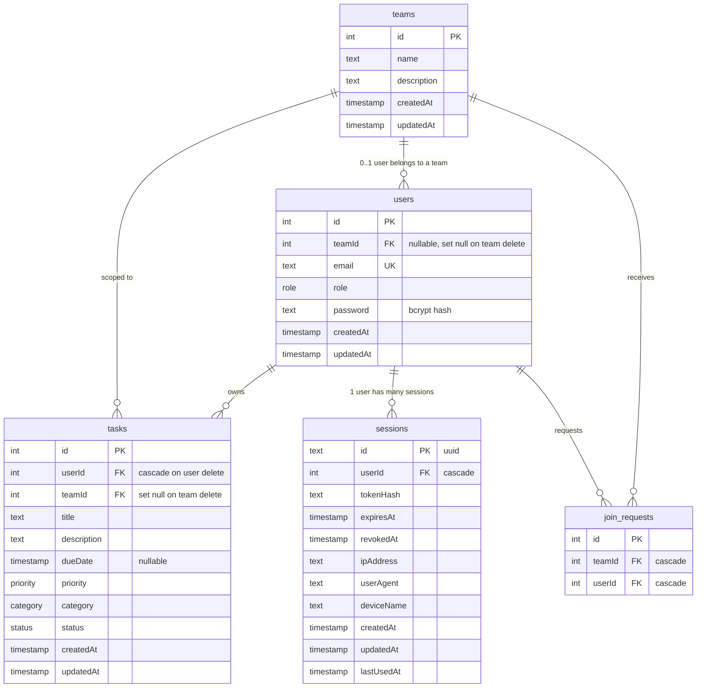

# Database

PostgreSQL 17 with Drizzle ORM as a thin typed wrapper. The project deliberately avoids AWS RDS so we don't have to wire up VPCs, security groups, or anything serverless-adjacent for a learning sandbox — any reachable Postgres works (local install in dev, a managed provider that hands you a `DATABASE_URL` for shared use).

## Connection ([`config/db.ts`](../config/db.ts))

```ts
const pool = new Pool({
  connectionString: process.env.DATABASE_URL,
});

export const db = drizzle(pool);
```

A single process-wide `pg.Pool` is created at boot. Drizzle wraps it. Every module that needs DB access does `import db from "../config/db"`.

> If you point at a managed Postgres that requires TLS, the minimal change is to pass `{ ssl: { rejectUnauthorized: false } }` to `new Pool(...)`, or append `?sslmode=require` (or `?sslmode=no-verify` for self-signed certs) to the `DATABASE_URL`. Tighten certificate pinning before you call this production.

## Schema source of truth: [`config/schema.ts`](../config/schema.ts)

This file is read by both the runtime (`db.select().from(users)`) and `drizzle-kit` for migration generation. There's no separate SQL DDL — the TypeScript file *is* the schema.

### Enums

| Enum | Values |
|------|--------|
| `role` | `admin`, `user` |
| `priority` | `none`, `low`, `medium`, `high` |
| `category` | `work`, `personal`, `other` |
| `status` | `pending`, `completed`, `in_progress` |

Postgres enums are stricter than text + check constraint — invalid values fail at insert with a clear error.

### Tables



#### `users`

| Column | Type | Notes |
|--------|------|-------|
| `id` | `integer GENERATED ALWAYS AS IDENTITY` | PK |
| `teamId` | `integer` | FK -> `teams.id`, `on delete set null`. Nullable: a user may have no team. The "one team per user" invariant is enforced by application code in `controllers/teams.ts`. |
| `email` | `text` unique | |
| `role` | `role` enum | Default `user` |
| `password` | `text` | `bcrypt` hash, salt rounds `10` ([`consts.ts`](../consts.ts)) |
| `createdAt`, `updatedAt` | `timestamp` | `defaultNow()` |

Indexes: unique on `email`, plus btree on `teamId`, `role`, `createdAt`, `updatedAt`.

#### `teams`

Trivial — `id`, `name`, `description`, timestamps. Indexed on `name`, `createdAt`, `updatedAt`.

#### `tasks`

| Column | Type | Notes |
|--------|------|-------|
| `id` | `integer identity` | |
| `userId` | `integer` | FK -> `users.id`, `on delete cascade`. Tasks die with their owner. |
| `teamId` | `integer` | FK -> `teams.id`, `on delete set null`. Personal task = `null`. |
| `title`, `description` | `text` | required |
| `dueDate` | `timestamp` | nullable |
| `priority`, `category`, `status` | enums | default `none`/`other`/`pending` |
| `createdAt`, `updatedAt` | `timestamp` | `updatedAt` is bumped manually in `updateTask` (no trigger) |

Indexes: `userId`, `teamId`, `dueDate`, `priority`, `category`, `status`. The first two power the dominant queries (`getTasksByUserId`, `getTasksByTeamId`); the rest are speculative indexes for filtering work that might land in the API later.

#### `sessions`

See [`auth-and-sessions.md`](auth-and-sessions.md). Worth highlighting:

- `id` is a **UUID** (`crypto.randomUUID()` set by `$defaultFn`), not an autoincrement int. This is what gets returned to the client as `sessionId` so it doesn't leak row-count cardinality.
- `tokenHash` is what you query against — never the raw token.
- `revokedAt` lets you soft-revoke (e.g. for "log out everywhere except this device" scenarios) without losing audit history.

#### `join_requests`

Pending requests for a user to join a team. When an admin approves, `controllers/joinRequests.ts` updates `users.teamId` and `delete`s the row. Denial just `delete`s the row. There's no `status` column — request rows only exist while pending.

## Drizzle conventions used here

- **`pgTable`** with column shorthand (`integer().primaryKey().generatedAlwaysAsIdentity()`) instead of the raw SQL builders.
- **Type inference** via [`types.ts`](../types.ts):
  ```ts
  export type User = InferSelectModel<typeof users>;
  export type NewUser = InferInsertModel<typeof users>;
  ```
  Add a column to the schema → the inferred type updates automatically. No manual sync.
- **Indexes co-located with the table definition** as a `(table) => [...]` array — they live and migrate together.
- **No relations API** (`relations(...)`) is used. Joins are done with `.innerJoin(...)` directly because the controllers are small enough that explicit joins read clearly. See [`controllers/joinRequests.ts`](../controllers/joinRequests.ts) for an example.

## `drizzle-kit` workflow

[`drizzle.config.ts`](../drizzle.config.ts) points at `./config/schema.ts` for the schema and writes migration SQL to `./drizzle/`.

```bash
# Generate a SQL migration based on schema diff
npx drizzle-kit generate

# Apply migrations to DATABASE_URL
npx drizzle-kit migrate

# Push the schema directly (skip the migration folder — useful in dev)
npx drizzle-kit push
```

For this learning project `push` is fine because the schema is small and there's no production DB to coordinate with. For anything you want to ship, prefer `generate` + `migrate` and commit the SQL.

## Seed data

[`scripts/seed.ts`](../scripts/seed.ts) — `npm run seed`.

- 10 fake users (`@seed.local`, password `123`).
- 3 teams (`Engineering`, `Design`, `Operations`).
- ~80% of users get assigned to a random team; tasks are sprinkled across personal + team scopes.
- Idempotent for users/teams (looked up by email/name) but task rows are inserted unconditionally — running twice doubles task counts.
- Real accounts listed in `EXISTING_USER_EMAILS` get tasks attached without modifying their password / role / teamId.

## Common queries you'll see in the controllers

```ts
// Get a user by id, project columns to drop the password hash
const [user] = await db.select(safeUserSelection).from(users).where(eq(users.id, id));

// Get tasks for a team, latest first, paginated
const rows = await db
  .select()
  .from(tasks)
  .where(eq(tasks.teamId, teamId))
  .orderBy(desc(tasks.updatedAt))
  .limit(limit)
  .offset(offset);

// Update + return the row in one round-trip
const [updatedTask] = await db
  .update(tasks)
  .set({ title, description, updatedAt: new Date() })
  .where(eq(tasks.id, id))
  .returning();

// Multi-table read with explicit joins (no relations API)
const rows = await db
  .select({
    id: joinRequests.id,
    teamId: teams.id,
    teamName: teams.name,
    userId: users.id,
    userEmail: users.email,
  })
  .from(joinRequests)
  .innerJoin(teams, eq(joinRequests.teamId, teams.id))
  .innerJoin(users, eq(joinRequests.userId, users.id));
```

## Operational notes

- **Connection pool sizing**: defaults from `pg` (`max: 10`). Fine for one local dev process.
- **TLS**: not configured by default. Most managed Postgres providers reject plain TCP — append `?sslmode=require` (or `?sslmode=no-verify` for self-signed certs) to `DATABASE_URL`, or add `ssl` config to the pool. Local Postgres usually doesn't need any of this.
- **Migrations** committed to `./drizzle/` (when you generate them). Treat that folder as part of the schema's git history.
- **No down-migrations.** Drizzle generates forward-only SQL. Plan accordingly.
