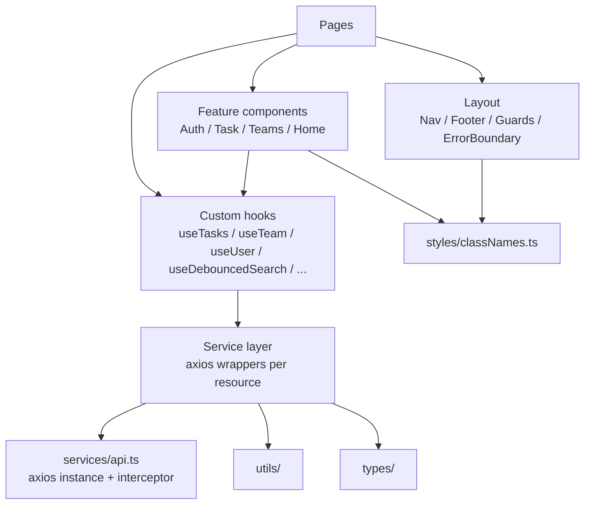
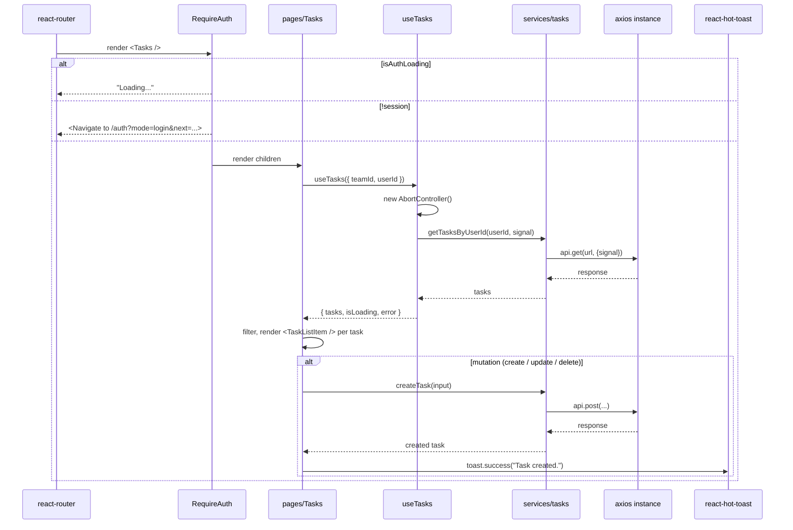

# Frontend architecture

A guided tour of how the React app is organized and why each layer exists.

## Layered shape



The **dependency direction is one-way**: pages depend on features, features depend on hooks/styles, hooks depend on services, services depend on the api singleton + utils + types. Nothing reaches the other way (e.g. services don't import from `components/`).

## Folder responsibilities

| Path | Responsibility |
|------|----------------|
| [`src/main.tsx`](../src/main.tsx) | Mounts `<App />`. Wires `BrowserRouter`, `AppProvider`, `AuthProvider` in the right order so `useNavigate` is available inside auth context. |
| [`src/App.tsx`](../src/App.tsx) | Lazy-loaded routes, `<Suspense>` fallback, `<RequireAuth>` / `<RequireAdmin>` wrapping, `<ErrorBoundary>` at the root, `<Toaster />` mount. |
| [`src/pages/`](../src/pages/) | Thin orchestrators. Compose feature components and hooks; should not contain raw HTTP calls or low-level state machines. |
| [`src/components/`](../src/components/) | PascalCase feature folders. One component per file. Cross-feature primitives live in `Ui/`. |
| [`src/hooks/`](../src/hooks/) | Custom hooks for data fetching (`useTasks`, `useTeam`, ...) and UI behaviors (`useModalChrome`). All loading hooks return `{ data, isLoading, error }`-shaped state with `AbortController` cancellation. |
| [`src/services/`](../src/services/) | Per-resource axios wrappers. Read functions accept an optional `signal?: AbortSignal`; mutations don't. |
| [`src/context/`](../src/context/) | `AuthContext` (session validation + auth-expired listener) and `AppContext` (cached teams list / selected team id). |
| [`src/types/`](../src/types/) | Shared TypeScript types (`Task`, `Team`, `AuthUser`, `JoinRequestRow`). Re-exported from services for back-compat. |
| [`src/constants/`](../src/constants/) | App-wide constant maps (priority/category/status labels, styles, options). |
| [`src/utils/`](../src/utils/) | `date`, `normalizeTask`, `taskForm`, `validation`. |
| [`src/styles/classNames.ts`](../src/styles/classNames.ts) | Canonical Tailwind class strings — single source of truth for `inputClass`, `primaryBtnClass`, `eyebrowClass`, etc. |
| [`src/index.css`](../src/index.css) | Tailwind import, CSS variables, global element rules. |

## Provider hierarchy ([`src/main.tsx`](../src/main.tsx))

```tsx
<StrictMode>
  <BrowserRouter>
    <AppProvider>
      <AuthProvider>
        <App />
      </AuthProvider>
    </AppProvider>
  </BrowserRouter>
</StrictMode>
```

Order matters:

- `BrowserRouter` is **outermost** so the auth provider can call `useNavigate()` for the `auth:expired` redirect.
- `AppProvider` wraps `AuthProvider` because the cached teams list isn't auth-dependent — having it outside means logout doesn't blow it away.

## Render flow for a typical authenticated page



## What each tier knows

- **Pages** know about hooks and feature components. They don't import from `services/` directly **except** for mutations (`createTask`, `updateTask`, `deleteTask`) — those are short-lived user-triggered calls that don't need the cancellation machinery, so wrapping them in a hook would be ceremony.
- **Feature components** know about other feature components, `Ui/` primitives, and `styles/classNames.ts`. They sometimes use a hook (e.g. `AdminUserSearchPanel` uses `useDebouncedSearch`).
- **Hooks** know about `services/` and may use other hooks. They never render JSX.
- **Services** know about `api.ts`, `types/`, and `utils/`. They never import from React.
- **`api.ts`** knows nothing — it's a pure axios instance + a single response interceptor.

## Code-splitting

[`App.tsx`](../src/App.tsx) wraps every page in `lazy(() => import("./pages/Foo"))` so each page is its own webpack/Vite chunk. The `<Suspense fallback={<RouteFallback />}>` shows a "Loading..." while the chunk downloads.

Production build chunks (gzipped):

| Chunk | Size | What |
|-------|------|------|
| `index-*.js` | ~60 kB | React + react-dom + react-router + axios + react-hot-toast vendors |
| `AuthContext-*.js` | ~16 kB | AuthContext + axios eager dep (every page needs HTTP) |
| `classNames-*.js` | ~18 kB | Shared Tailwind class strings + Ui primitives |
| `Home-*.js` | ~4 kB | Marketing page sections |
| `Tasks-*.js`, `TaskDetails-*.js`, `Teams-*.js`, `Auth-*.js`, `Admin-*.js`, `Profile-*.js`, `NotFound-*.js` | 0.3–4 kB each | Per-route page chunks |

If you ever need to add a "below the fold" component to a page that significantly increases its weight, lazy-load it inside the page too with `React.lazy`.

## Why no Redux / Zustand / Jotai

`AuthContext` and `AppContext` cover the only two pieces of state that are genuinely shared across pages (session + cached teams list). Everything else is local component state. Adding a state library would solve a problem this app doesn't have.

If/when you need cross-page reactive state for something new, the choice is:

1. Lift the state into one of the existing contexts (cheap, but bloats the value object — every consumer re-renders on any change).
2. Add a new dedicated context (best for orthogonal concerns; the hierarchy stays shallow because there are only two contexts today).
3. Add a state library (only worthwhile if you start needing selectors / fine-grained subscriptions to avoid render storms — not the case yet).

## Why no React Query / SWR / tRPC

Same reasoning, but more deliberate. The `hooks/` layer is a hand-rolled equivalent of the "fetch on mount with cancellation" piece of React Query, intentionally kept small so the request lifecycle is visible end-to-end. See [`data-fetching.md`](data-fetching.md) for the full breakdown.

## Adding a new page

1. Create `src/pages/Foo.tsx` — thin orchestrator using existing hooks.
2. If it needs new HTTP, add a wrapper in `src/services/<resource>.ts` (with optional `signal?` for reads).
3. If you need to share data-fetching logic, add a hook in `src/hooks/useFoo.ts`.
4. Lazy-import the page in [`App.tsx`](../src/App.tsx) and add a `<Route>` (wrapped in `<RequireAuth>` if needed).
5. If it needs a new shared style, add it to [`src/styles/classNames.ts`](../src/styles/classNames.ts) — don't inline new Tailwind strings into pages.

## Adding a new feature component

1. Decide which feature folder it belongs in (`Auth/`, `Task/`, `Teams/`, `Home/`, etc.). Cross-feature primitives go in `Ui/`.
2. One component per file, `default export`.
3. Use the existing classes from [`styles/classNames.ts`](../src/styles/classNames.ts) wherever possible. If you find yourself duplicating a class string in two files, hoist it.
4. If the component owns a side effect, put the side-effect logic in a hook (`useFoo`) and keep the component declarative.
