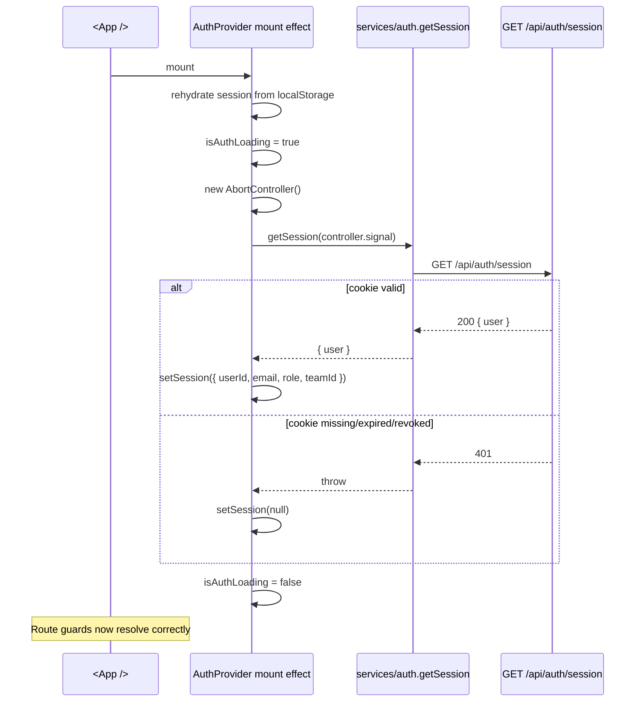
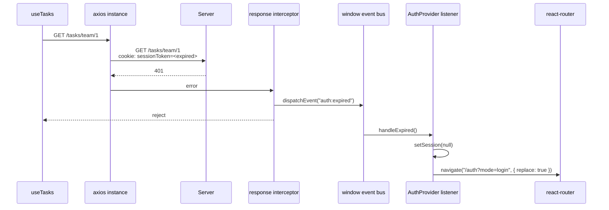

# Auth & session (frontend side)

This is the React side of the auth story. The cookie + DB session model lives on the backend — see [`../../backend/docs/auth-and-sessions.md`](../../backend/docs/auth-and-sessions.md). Here we cover what the React app does with that session.

## State sources

There are **two** representations of the current session in the browser:

1. The **`sessionToken` `httpOnly` cookie**, set by the backend. JavaScript can't read it. It's the actual proof of authentication.
2. The **`AuthSession` cached in `localStorage`** (key `activity-tracker.auth-session.v1`), used by `AuthContext` to render the right UI immediately on page load before the server round-trip resolves.

The cache is **decorative**, not authoritative. The backend always re-validates the cookie on every protected request. The cache exists so the page doesn't flicker between "logged out" and "logged in" while the boot probe runs. See "Boot validation" below.

## `AuthContext` ([`src/context/AuthContext.tsx`](../src/context/AuthContext.tsx))

The provider exposes:

```ts
type AuthContextValue = {
  session: AuthSession | null;       // current cached session (rehydrated from localStorage on first render)
  isAuthLoading: boolean;            // true until the boot probe to /api/auth/session resolves
  setSession: (session: AuthSession | null) => void;   // also writes/clears localStorage
  refreshSession: () => Promise<AuthSession | null>;   // re-fetch session from server, sync local state + cache
};
```

`AuthSession` shape:

```ts
type AuthSession = {
  userId: string;          // string everywhere on the client to dodge bigint footguns
  email?: string;
  role: "admin" | "user";
  teamId?: string | null;
};
```

Consumed via `const { session, isAuthLoading } = useAuth();`.

## Boot validation



Why this exists: a user can edit `localStorage` to flip `role: "user"` to `role: "admin"`, which would render the Admin nav link and let them visit `/admin` (the route guard checks `session.role`). The backend would still 403 their actual API requests, but the UX would be confusing. The boot validation re-fetches the truth from the server and overwrites the cache.

The fetch is wrapped in an `AbortController` so the StrictMode dev double-fire doesn't race two responses into the same `setSession` call. See [`data-fetching.md`](data-fetching.md) for the cancellation pattern.

## 401 interceptor + `auth:expired` event

The axios response interceptor in [`src/services/api.ts`](../src/services/api.ts) detects when a non-auth endpoint returns 401 (i.e. "you had a session, but it's no longer valid") and dispatches a window-level event:

```ts
if (status === 401 && !url.startsWith("/auth")) {
  window.dispatchEvent(new CustomEvent(AUTH_EXPIRED_EVENT));
}
```

`AuthContext` listens for that event:

```ts
useEffect(() => {
  const handleExpired = () => {
    if (isExpiringRef.current) return;     // dedup concurrent triggers
    isExpiringRef.current = true;
    setSession(null);
    navigate("/auth?mode=login", { replace: true });
    window.setTimeout(() => { isExpiringRef.current = false; }, 0);
  };
  window.addEventListener(AUTH_EXPIRED_EVENT, handleExpired);
  return () => window.removeEventListener(AUTH_EXPIRED_EVENT, handleExpired);
}, [navigate, setSession]);
```

The `isExpiringRef` ref prevents an N+1 redirect storm if multiple in-flight requests all 401 at once (very common — a single page can have 3-4 simultaneous data fetches).



The intentional decoupling: the interceptor doesn't know about React or the router; it just emits an event. The provider doesn't know about HTTP; it just listens. Either side can be replaced without touching the other.

> The `!url.startsWith("/auth")` guard is so that a failed login (401 on `/auth/login`) doesn't trigger the expired-session redirect — the user is already on `/auth`, and `AuthModal`'s own `try/catch` shows the error toast.

## Login / register / logout

[`AuthModal`](../src/components/Auth/AuthModal.tsx) handles login + signup with shared form state and a `mode` query param to switch between the two. On success:

```ts
const response = isLogin ? await login(...) : await register(...);
setSession({
  userId: String(response.user.id),
  email: response.user.email,
  role: response.user.role,
  teamId: response.user.teamId === null ? null : String(response.user.teamId),
});
toast.success(isLogin ? "Signed in." : "Account created.");
const next = searchParams.get("next");
navigate(next ? decodeURIComponent(next) : "/teams", { replace: true });
```

Logout (in [`Layout/Nav.tsx`](../src/components/Layout/Nav.tsx)):

```ts
try {
  await logout();
  toast.success("Signed out.");
  navigate("/");
} catch {
  toast.error("Could not sign out cleanly. Session has been cleared locally.");
} finally {
  setSession?.(null);   // wipe local state + localStorage no matter what
}
```

The `finally` clears the local cache even if the network request to delete the server-side session row failed — the user clicked "sign out", so we should at minimum stop pretending they're signed in client-side.

## When to call `refreshSession()`

Whenever a successful mutation could have changed the user's identity, role, or team membership:

- After approving your own pending join request (admin who joined their own team).
- After leaving a team (changes `session.teamId`).
- After being assigned to a team by an admin.

Search for `refreshSession()` usages in [`pages/Tasks.tsx`](../src/pages/Tasks.tsx) and [`pages/Admin.tsx`](../src/pages/Admin.tsx) for examples. Don't call it on a polling timer — the boot validation + 401 interceptor already cover staleness.

## Why `localStorage` and not `sessionStorage`

`sessionStorage` is per-tab. Most users expect "I'm logged in" to persist across tab opens, so `localStorage` matches expectation. The cookie is `Max-Age=7d`, so the cache is effectively bounded by the cookie anyway.

## Why a versioned key (`...v1`)

`activity-tracker.auth-session.v1`. If the `AuthSession` shape ever changes incompatibly (e.g. add a required `permissions` array), bump to `v2` and let `loadStoredSession` return `null` for the old key — users get gracefully forced into a fresh login instead of a parse crash.

## Threat-modeling client-side

Client-side auth is **never the security boundary** — the backend is. The frontend's job is only to:

1. Show the right UI for what the server says you can do.
2. Stop sending requests it knows will 401 (fail-fast UX).
3. Recover gracefully when the server tells it the session is gone.

Things the client deliberately does **not** try to do:

- Verify or sign tokens (they're opaque + httpOnly).
- Track session expiration time (the server is the clock).
- Refresh-on-use (the cookie is `Max-Age=7d`; sliding-window would need a backend change).
- CSRF tokens (the backend uses `sameSite: lax`; if you ever lower that to `none`, the frontend will need to read a CSRF token cookie and echo it as a header).

See [`../../backend/docs/auth-and-sessions.md`](../../backend/docs/auth-and-sessions.md) for the full server-side picture.
