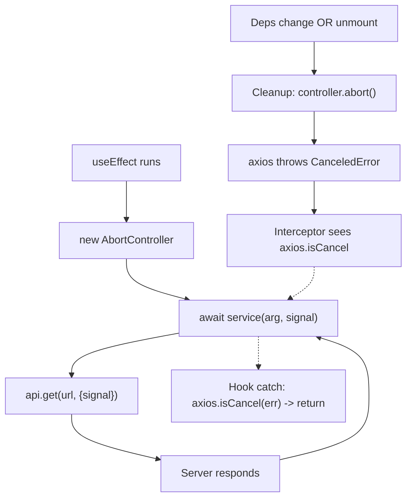

# Data fetching

This is the deepest "do it by hand instead of a library" choice in the frontend. The app **does not use React Query, SWR, or tRPC**. Every fetch goes through a four-layer stack:

```
Component / Page
       │
       ▼
   Custom hook (cancellation, loading state, error state)
       │
       ▼
   Service function (axios call, optional AbortSignal)
       │
       ▼
   axios instance + response interceptor (services/api.ts)
```

The trade-off vs React Query: no auto-refetch on focus, no background revalidation, no shared cache, no retry-with-backoff. The win: you can read the entire fetch lifecycle of any page in under 60 lines, and you've earned the right to choose React Query later when you understand exactly which problems it solves.

## Layer 1 — `services/api.ts`

A single axios instance + a single response interceptor:

```ts
export const api = axios.create({
  baseURL: import.meta.env.VITE_BACKEND_URL,
  withCredentials: true,                      // send the sessionToken cookie
});

api.interceptors.response.use(
  (response) => response,
  (error) => {
    // Caller aborted (e.g. effect cleanup). Not a real failure.
    if (axios.isCancel(error)) return Promise.reject(error);

    if (isAxiosError(error)) {
      const status = error.response?.status;
      const url = error.config?.url ?? "";
      // 401 outside of /auth = session expired -> tell AuthProvider
      if (status === 401 && !url.startsWith("/auth")) {
        window.dispatchEvent(new CustomEvent(AUTH_EXPIRED_EVENT));
      }
    }
    if (import.meta.env.DEV) {
      console.error("[api] request failed", error);
    }
    return Promise.reject(error);
  },
);
```

This is the **one place** that knows about cross-cutting HTTP concerns:

| Concern | What the interceptor does |
|---------|---------------------------|
| Cancellations | Silently propagate (no log, no event) so callers can `axios.isCancel(err) -> return` |
| Expired sessions | Dispatch `auth:expired` so `AuthContext` clears state + redirects |
| Dev observability | Log every other failure to the console (off in production builds) |

Service functions don't need to repeat this logic — they just `await api.get(...)` and let exceptions propagate.

## Layer 2 — Service functions ([`src/services/`](../src/services/))

One file per resource. Reads accept an optional `signal?: AbortSignal`; mutations don't.

```ts
// services/tasks.ts (read example)
export const getTasksByUserId = async (userId: string, signal?: AbortSignal) => {
  const response = await api.get<TaskLike[]>(`/tasks/user/${userId}`, { signal });
  return normalizeTaskCollection(response.data);
};

// services/tasks.ts (mutation example)
export const createTask = async (taskBody: TaskInput) => {
  const response = await api.post<TaskLike>("/tasks", toApiBody(taskBody));
  return requireTask(response.data);
};
```

Why reads-only-take-signals: cancelling a `POST /tasks` mid-flight risks the server creating the row anyway and the client never seeing the response — half-applied state with no audit trail. Mutations should always run to completion (or fail with a clear error) so the UI can show an accurate result. Reads are safe to abort because the worst case is "request the data again."

Service functions also do **shape normalization** at the boundary: see [`utils/normalizeTask.ts`](../src/utils/normalizeTask.ts). The API can return `id` as `number | string`, `teamId` as `number | string | null`, etc. The normalizer coerces everything into the strict client-side `Task` shape so the rest of the app doesn't need defensive `String(x)` calls.

## Layer 3 — Custom hooks ([`src/hooks/`](../src/hooks/))

The pattern that every read hook follows:

```ts
export const useThing = (id) => {
  const [data, setData] = useState(null);
  const [isLoading, setIsLoading] = useState(false);
  const [error, setError] = useState(null);

  useEffect(() => {
    if (!id) { /* reset state, return early */ return; }

    const controller = new AbortController();
    setIsLoading(true);
    setError(null);

    void (async () => {
      try {
        const result = await getThing(id, controller.signal);
        if (controller.signal.aborted) return;
        setData(result);
      } catch (err) {
        if (axios.isCancel(err) || controller.signal.aborted) return;
        setData(null);
        setError("Could not load thing.");
      } finally {
        if (!controller.signal.aborted) setIsLoading(false);
      }
    })();

    return () => controller.abort();
  }, [id]);

  return { data, isLoading, error };
};
```

Three things to call out:

1. **`AbortController` + `signal` to the service.** When the deps change or the component unmounts, `controller.abort()` runs in cleanup. Axios throws `CanceledError`, the interceptor swallows it, and the catch block short-circuits via `axios.isCancel(err)`. The actual TCP connection to the server is closed — bandwidth saved.
2. **Belt-and-suspenders `if (controller.signal.aborted) return` after every await.** Guards against any race where the request completes between the abort and the catch (extremely rare, but free to defend against).
3. **Cleanup also guards `setIsLoading(false)`.** Without this, a cancelled request would leave the component thinking it's still loading.

Concrete examples in the codebase: [`useTasks`](../src/hooks/useTasks.ts), [`useTeam`](../src/hooks/useTeam.ts), [`useUser`](../src/hooks/useUser.ts), [`useMyJoinRequests`](../src/hooks/useMyJoinRequests.ts), [`useAdminJoinRequests`](../src/hooks/useAdminJoinRequests.ts). See [`hooks.md`](hooks.md) for per-hook reference.

## The four cancellation problems and how this stack solves them



| Problem | Where it's solved |
|---------|-------------------|
| **Stale state** ("the response from `/team/1` lands after I navigated to `/team/2` and overwrites the new data") | The post-await `if (signal.aborted) return` guard in every hook |
| **Memory leak / setState on unmounted component** | The cleanup `controller.abort()` + the same guard |
| **Wasted bandwidth + server work** ("I'm typing fast and firing 5 search requests/second; only the last matters") | The `signal` is forwarded into axios, which actually closes the TCP socket. Server can choose to abandon work too. |
| **False error surfacing** ("the request was cancelled but I'm showing an error toast") | The interceptor swallows `axios.isCancel`; hooks early-return on the same check before setting `error` state |

## Debounced search — special case

[`hooks/useDebouncedSearch.ts`](../src/hooks/useDebouncedSearch.ts) handles the "debounce + cancel previous in-flight" combo:

```ts
useEffect(() => {
  if (!enabled) return;
  const trimmed = query.trim();
  if (!trimmed) { reset(); return; }

  const controller = new AbortController();
  setState((prev) => ({ ...prev, isLoading: true, error: null }));

  const timeoutId = window.setTimeout(async () => {
    try {
      const results = await fetcher(trimmed, controller.signal);
      if (controller.signal.aborted) return;
      setState({ results, isLoading: false, error: null });
    } catch (error) {
      if (axios.isCancel(error) || controller.signal.aborted) return;
      setState({ results: null, isLoading: false, error });
    }
  }, delayMs);

  return () => {
    controller.abort();      // cancel in-flight HTTP
    window.clearTimeout(timeoutId); // cancel pending debounce
  };
}, [query, enabled, delayMs, fetcher]);
```

Two cleanups (`abort` + `clearTimeout`) cover the two phases the request can be in: still waiting for the debounce to fire, or already in axios.

Used by [`AdminUserSearchPanel`](../src/components/Task/AdminUserSearchPanel.tsx). Type-fast in the user search box and watch DevTools Network — only the final keystroke's request reaches `200`; all earlier ones go `(canceled)`.

## Layer 4 — Components / pages

Components consume the hook and never touch axios directly:

```tsx
const Tasks = () => {
  const { tasks, setTasks, isLoading, error } = useTasks({ teamId, userId });

  // ...mutations are inline because they're short-lived and user-triggered
  const handleTaskSubmit = async (input) => {
    setIsSavingTask(true);
    try {
      const created = await createTask(input);
      setTasks((previous) => [created, ...previous]);   // optimistic-ish update
      toast.success("Task created.");
    } catch {
      setTaskFormError("Could not create task. Try again.");
    } finally {
      setIsSavingTask(false);
    }
  };

  return /* JSX */;
};
```

Note the **mutation pattern**:
- No hook wrapping (these are user-click-triggered, not effect-driven).
- Wrapped in `try/catch` for local error surfacing.
- Successful response is folded into the local `tasks` array with `setTasks((prev) => [created, ...prev])` so we don't refetch on every create.
- Toast for success, inline error for failure — see [`error-and-feedback.md`](error-and-feedback.md).

## What this stack does NOT give you

- **No shared cache.** If three components mount `useTasks({ userId: "5" })` at the same time, you get three HTTP requests. Acceptable for this app's structure (only one consumer per resource per page); real apps probably want React Query for this.
- **No background revalidation.** No "refetch when the tab regains focus." Tabs that sit idle for 30 minutes still show stale data.
- **No retry-with-backoff.** A transient 500 surfaces as an error immediately. If you want retries, add them in the service or in the hook.
- **No mutation queue.** Optimistic updates are manual; rollback on failure is your problem (the Tasks page does it correctly for create; check the others if you extend).
- **No suspense integration.** Loading state is `isLoading: boolean`, not React Suspense. Adding suspense would mean rewriting hooks to throw promises — possible but a bigger lift.

If you ever hit one of these limitations and want to fix it the React-Query-y way, the hook layer is the single seam where you'd swap in `useQuery({ queryKey: ['tasks', userId], queryFn: () => getTasksByUserId(userId) })`. The component never knew about axios in the first place, so it doesn't have to change.

## Performance summary (current behavior)

- Route navigation cancels in-flight requests for the page you left.
- Search input cancels superseded keystrokes.
- StrictMode dev double-fires don't race two responses (the abort guard handles it).
- 401s on protected endpoints trigger one redirect, not N (the `isExpiringRef` dedupe).
- No request is wasted on the server side after the user has navigated away (the TCP socket gets `RST` from `controller.abort()`).

Inspect the wins in DevTools Network: rapid route changes between `/tasks/team/1` → `/tasks/team/2` → `/tasks/team/3` show the abandoned `GET /tasks/team/...` requests as `(canceled)`. Type fast in the admin search and only the final query completes.
