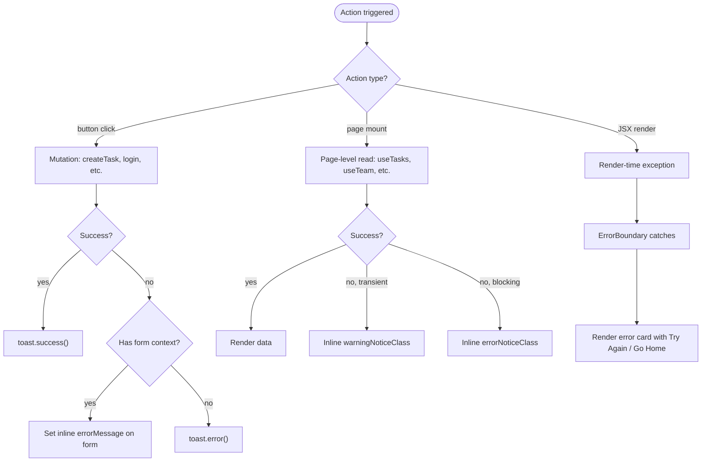

# Errors & feedback

Three feedback channels in the app, each with a clear use case:

| Channel | Use for | Implementation |
|---------|---------|----------------|
| `react-hot-toast` | Transient async result feedback | `<Toaster />` mounted in `App.tsx`, `toast.success(...)` / `toast.error(...)` per call site |
| Inline error notice | Validation / load errors that need to live next to a specific UI region | `errorNoticeClass` / `warningNoticeClass` from `styles/classNames.ts` |
| `ErrorBoundary` | Uncaught render errors | Class component in `Layout/ErrorBoundary.tsx`, wrapping the entire `<Suspense>` route tree |

Confirmation prompts are a fourth, smaller channel: `Ui/ConfirmModal` for any destructive action.

## Toast notifications

[`react-hot-toast`](https://react-hot-toast.com/) mounted once in [`App.tsx`](../src/App.tsx):

```tsx
<Toaster
  position="top-right"
  toastOptions={{
    className:
      "!bg-[var(--bg)] !text-[var(--text-h)] !border !border-[var(--border)] !shadow-[var(--shadow)] !text-[14px]",
    duration: 3500,
  }}
/>
```

Anywhere in the app:

```ts
import { toast } from "react-hot-toast";

toast.success("Task created.");
toast.error("Could not delete this task.");
```

### When to use a toast

- After a successful mutation (create / update / delete / assign / approve / deny / leave / login / logout).
- After a failed mutation that doesn't have a specific UI region to attach to (most non-form async errors).

### When NOT to use a toast

- Form-field validation errors → inline below the input (see [`forms-and-validation.md`](forms-and-validation.md)).
- Page-level "couldn't load this page's data" → inline `errorNoticeClass` so the user can scroll back and see it (toasts disappear).
- Form-submit errors that need the user to revise the form → inline `errorMessage` prop on the form component (see `TaskFormModal`'s `errorMessage`).

## Inline notices

From [`styles/classNames.ts`](../src/styles/classNames.ts):

| Class | When |
|-------|------|
| `noticeClass` | Neutral informational ("Pending requests will appear here") |
| `noticeCompactClass` | Same, smaller padding for use inside cards |
| `warningNoticeClass` | Recoverable degraded state ("Could not load tasks right now") |
| `errorNoticeClass` | Hard error blocking the panel ("Could not load this task.") |

Used in:

- [`pages/TaskDetails.tsx`](../src/pages/TaskDetails.tsx) — `errorNoticeClass` for "Could not load this task." (toast wouldn't help — the page can't render anything else).
- [`pages/Tasks.tsx`](../src/pages/Tasks.tsx) — `warningNoticeClass` for tasks-load failure (the rest of the page still works).
- [`Teams/CreateTeamSection.tsx`](../src/components/Teams/CreateTeamSection.tsx) — `warningNoticeClass` for "you're already on a team".

## ErrorBoundary

[`components/Layout/ErrorBoundary.tsx`](../src/components/Layout/ErrorBoundary.tsx) — class component (boundaries can't be functional yet) wrapping the entire route tree in [`App.tsx`](../src/App.tsx):

```tsx
<ErrorBoundary>
  <Suspense fallback={<RouteFallback />}>
    <Routes>...</Routes>
  </Suspense>
</ErrorBoundary>
```

When any descendant throws during render:

1. `getDerivedStateFromError(error)` flips the boundary state to `{ hasError: true, error }`.
2. `componentDidCatch(error, info)` logs to the console.
3. The fallback UI renders inside `PageShell`: a card with title, optional error message, and two buttons:
   - **Try again** → calls `this.reset()` which clears boundary state. The next render re-attempts the failed subtree (works if the error was transient).
   - **Go home** → hard `<a href="/">` navigation that gets a fresh app load (works if the error is in module-level state).

### What it catches

- Runtime exceptions inside `render` of any descendant.
- Errors thrown by `useEffect` cleanups or hook bodies during render.
- Failed lazy-imports (`React.lazy` + `Suspense` rejects → caught by the nearest boundary).

### What it does NOT catch

- Errors inside event handlers (use `try/catch` and toast).
- Errors inside async functions that aren't awaited during render (same — `try/catch`).
- Errors in non-React code (e.g. timers).
- Server-side rendering issues (this app is CSR-only).

## Confirmation modal

[`Ui/ConfirmModal.tsx`](../src/components/Ui/ConfirmModal.tsx) — drop-in replacement for `window.confirm`. Built on [`Ui/Modal.tsx`](../src/components/Ui/Modal.tsx) so it gets the standard backdrop, focus-trap-ish escape handling, and body scroll lock.

```tsx
<ConfirmModal
  open={isConfirming}
  title="Delete task?"
  description="This cannot be undone."
  confirmLabel="Delete"
  destructive            // uses dangerBtnClass instead of primaryBtnClass
  isWorking={isDeleting} // disables both buttons + suppresses backdrop close
  onConfirm={handleDelete}
  onCancel={() => setIsConfirming(false)}
/>
```

The `isWorking` prop is the key UX detail: while `handleDelete` is running, the user can't escape the modal and accidentally trigger the delete twice. Once the request resolves (success → close + toast; failure → re-enable buttons + toast), the lock releases.

Used in [`pages/TaskDetails.tsx`](../src/pages/TaskDetails.tsx) for the delete flow. Use it any time a destructive action would benefit from explicit confirmation.

## End-to-end error story



The pattern: choose feedback channel based on **where the user's attention is** when the result lands, not based on what's easiest to add.
